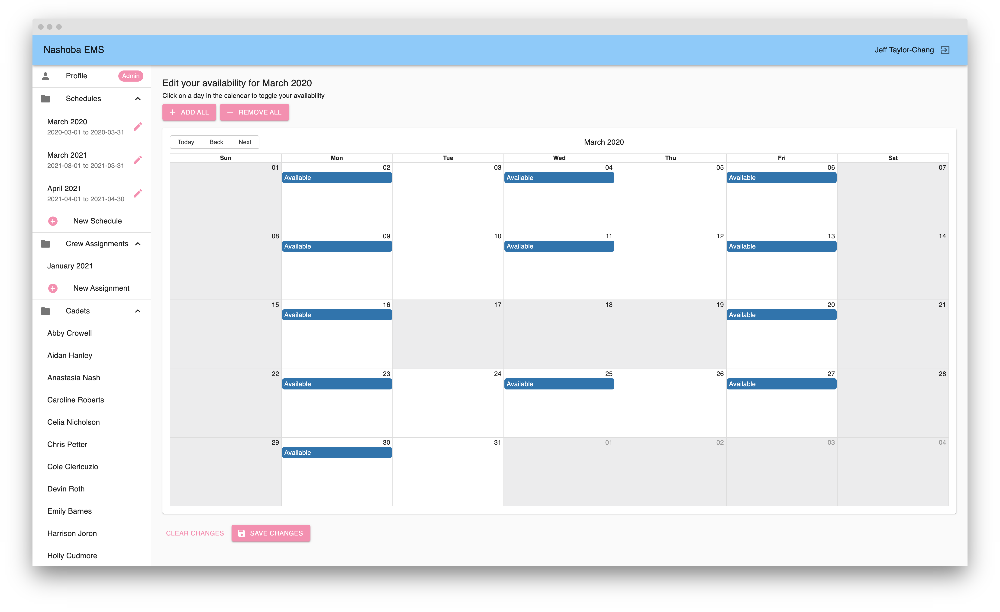
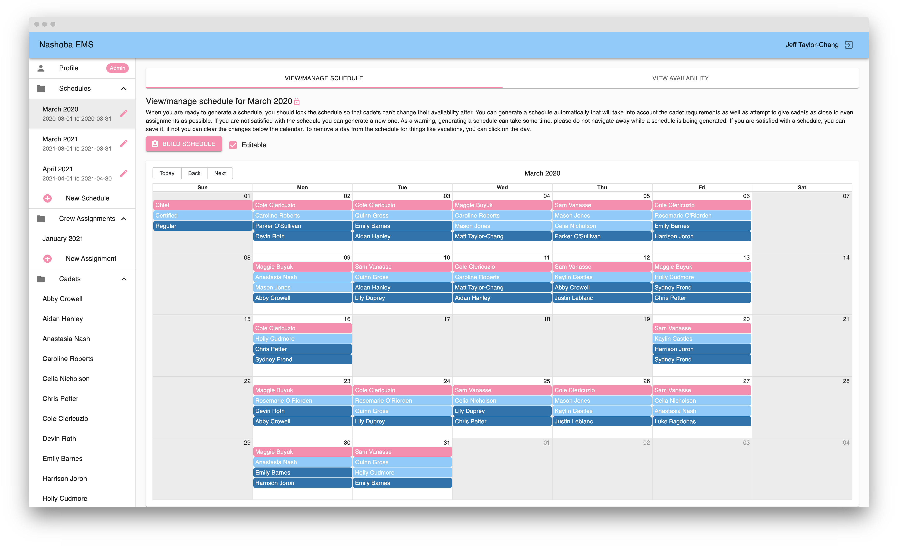
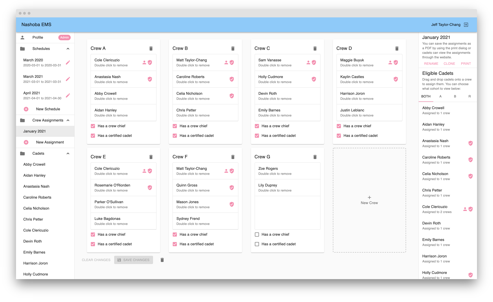
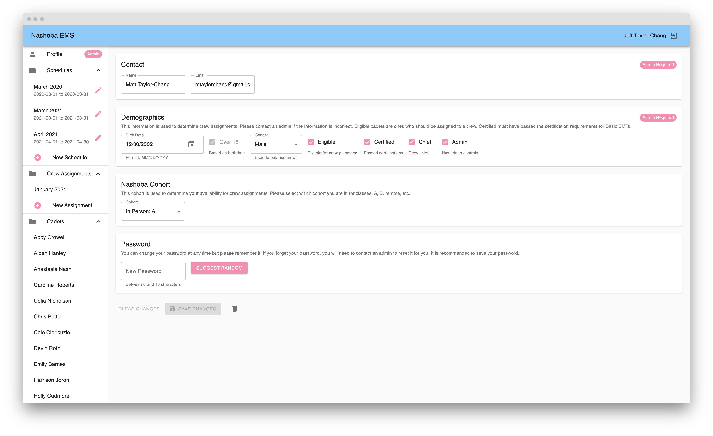

# emt-desktop

[](https://app.netlify.com/sites/nashoba-ems-scheduler/deploys) [](https://github.com/Nashoba-EMS/emt-desktop/actions/workflows/validation.yml) [](https://lgtm.com/projects/g/jtaylorchang/emt-desktop/context:javascript) [](https://github.com/jtaylorchang/emt-desktop)

## Setup

- Run `yarn install`
- Create `.env.production.local` file:

```
REACT_APP_API_URL="<API_URL>"
```

## Deploying

- Run `yarn deploy`
- Follow netlify directions for deploying

## Running Offline

- Start the `emt-backend`
- Run `yarn start`

## Features and screenshots

- Admins can create a schedule for a given range of days (typically one month). Admins can remove days that shouldn't have crews, for instance if there are vacation days in the month. Once a schedule has been created, each cadet can fill in their availability for the period:



- After all the cadets have input their availability, an admin can automatically generate a schedule that is compliant with state guidelines and is as fair as possible:



- When using a rotating crew schedule instead of a per-day schedule, admins can assemble crews using the drag-and-drop crew builder:



- Admins can create and manage cadet accounts to do things like reset their passwords or change their status as certified or as a chief:



## License

`@nashoba-ems/emt-desktop` is [BSD-3-Clause licensed](./LICENSE)
